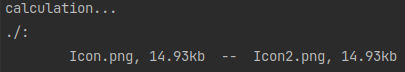

# antidup-rs (blazingly fast 🚀)
to find duplicates of photos (.png, .jpg and .jpeg)                                
based on [phash algorithm](https://www.phash.org/docs/pubs/thesis_zauner.pdf)

## TODO
- [x] Loading ~~animation~~ message
- [x] Display of image size in mb/kb/etc
- [ ] Recursive analysis of subdirectories
- [ ] Analysis of the selected directory
- [ ] Cache
